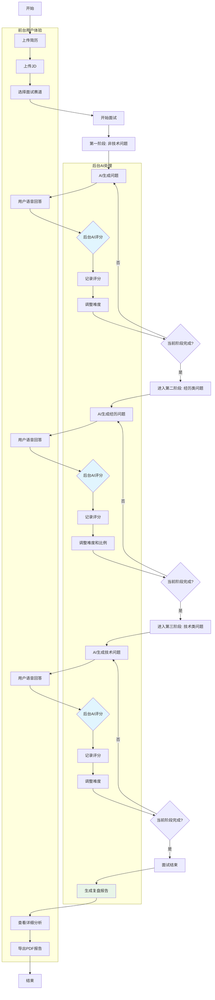
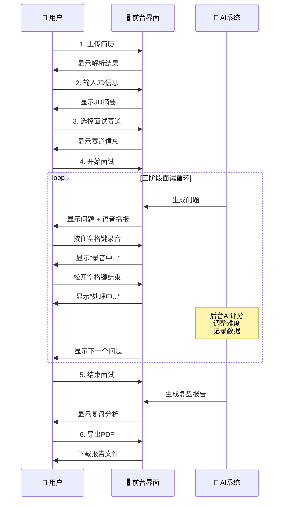
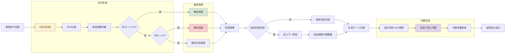

# 🤖 AI面试智能官 - 你的模拟面试助手

[](https://python.org)
[](LICENSE)
[]()

一个基于AI的智能面试系统，采用三阶段递进式面试流程，支持多个专业赛道，具备动态难度调整、JD匹配、实时评分反馈和专业报告导出功能，提供全方位的个性化面试体验。

## 🎯 核心特性

### 🎭 三阶段面试流程
采用科学的递进式面试结构，全面评估候选人能力：

#### 📍 **第一阶段：非技术问题**
- **考察目标**：基本情况、沟通能力、职业规划
- **问题类型**：自我介绍、发展规划、岗位认知、工作态度
- **基于数据**：简历信息 + JD职位要求
- **默认题数**：2题

#### 📍 **第二阶段：经历类问题**
- **考察目标**：项目经历、技术实现、问题解决
- **问题类型**：项目深挖、技术细节、挑战解决、团队协作
- **基于数据**：简历项目和工作经验
- **默认题数**：3题

#### 📍 **第三阶段：技术类问题**
- **考察目标**：专业技术能力、系统设计
- **问题类型**：核心技术、算法设计、架构能力、技术深度
- **基于数据**：JD技术要求 + 岗位职责
- **默认题数**：3题

### 🚀 多赛道支持
- **6大专业赛道**：后端、前端、算法、测试、产品、运营
- **专业题库**：每个赛道包含数百道真实面试题目
- **智能分类**：题目按难度自动分为简单、中等、困难三个级别

### 📄 JD智能解析
- **自动解析**：提取职位名称、技术要求、岗位职责
- **技术匹配**：识别核心技术栈和关键词
- **个性化提问**：基于JD要求生成针对性问题
- **支持技术**：Java、Python、React、Vue、Docker、微服务等主流技术

### 🧠 智能评分系统
- **AI自动评分**：0-1分制，人性化智能评估
- **多维度反馈**：完整性、准确性、深度、表达能力
- **人性化评分标准**：
  - 0.8-1.0: 优秀回答，有深度和创新见解
  - 0.6-0.8: 正常良好回答，大多数应在此区间
  - 0.4-0.6: 基本合理但略显简单
  - 0.0-0.4: 只有明显问题的回答才会这么低
- **隐私保护**：面试过程中不显示评分，仅在复盘报告中呈现

### ⚡ 动态智能调整
#### **难度调整**
- **人性化调整规则**：
  - 得分 ≥ 0.75：自动增加问题难度
  - 得分 < 0.5：自动降低问题难度
  - 0.5 ≤ 得分 < 0.75：保持当前难度

#### **问题比例调整**
- **表现优秀** (平均分 ≥ 0.75)：增加技术问题数量 (最多5题)
- **表现需改善** (平均分 < 0.5)：减少技术问题，增加基础问题
- **实时调整**：根据最近表现动态优化后续阶段
- **后台运行**：评分和调整过程完全在后台进行，不干扰面试体验

### 🎤 语音交互
- **中文语音识别**：基于Vosk引擎的高精度识别
- **语音播报**：AI问题自动语音播报
- **简单操作**：按住空格键录音，松开结束

### 📊 实时状态监控
- **阶段进度**：显示当前面试阶段和题目进度
- **面试状态**：显示当前难度、评分、问题计数
- **难度轨迹**：记录整个面试过程的难度变化
- **即时反馈**：每题评分后立即显示结果和改进建议

### 🔄 面试复盘系统
- **完整记录**：保存所有问答对话和评分详情
- **智能分析**：多维度表现分析和改进建议
- **可视化展示**：直观的复盘界面和数据展示
- **专业反馈**：基于AI的详细评价和建议
- **细致评级**：优秀(≥0.75) > 良好(≥0.6) > 一般(≥0.5) > 需改进(<0.5)

### 📋 PDF报告导出
- **专业报告**：标准化面试评估报告
- **完整内容**：基本信息、阶段表现、详细记录、综合评价
- **高质量格式**：支持中文字体，标准A4布局
- **一键导出**：便于HR和候选人后续参考

## 📁 项目结构（已模块化）

```
AI-interviewers/
├── main.py                       # 精简入口（启动应用）
├── requirements.txt              # 依赖包列表
├── README.md                     # 项目说明文档
├── ai_interview/                 # 核心功能模块包
│   ├── __init__.py
│   ├── app.py                    # 入口封装（加载模型、启动UI）
│   ├── ui.py                     # Tkinter图形界面
│   ├── voice.py                  # 录音与语音识别（Vosk）
│   ├── resume.py                 # 简历解析（PDF/DOCX）
│   ├── jd.py                     # JD职位描述解析
│   ├── stages.py                 # 三阶段面试管理
│   ├── questions.py              # 题库加载与难度分类
│   ├── scoring.py                # AI评分与难度调整
│   ├── prompting.py              # 动态提示与上下文抽取
│   └── knowledge.py              # 能力金字塔与岗位知识图谱（新增）
├── data/
│   ├── data.xlsx
│   ├── divide.py
│   └── data_divided/
│       ├── 后端.csv
│       ├── 前端.csv
│       ├── 算法.csv
│       ├── 测试.csv
│       ├── 产品.csv
│       └── 运营.csv
└── vosk-model-cn-0.15/          # 中文语音识别模型
```

## 🛠 安装配置

### 系统要求
- Python 3.8+
- macOS / Windows / Linux
- 至少4GB内存
- 网络连接（用于AI模型调用）

### 1. 克隆项目
```bash
git clone https://github.com/your-username/AI-interviewers.git
cd AI-interviewers
```

### 2. 安装依赖
```bash
pip install -r requirements.txt
```

### 3. 配置AI模型
确保您已安装并配置了Ollama：
```bash
# 安装 Ollama
curl -fsSL https://ollama.ai/install.sh | sh

# 下载模型
ollama pull deepseek-r1-with-tool-calls:latest
```

### 4. 验证安装
```bash
python -m py_compile ai_interview/*.py
```

## 🚀 使用指南

### 启动系统
```bash
python main.py
```

或以函数方式启动（便于集成到其它脚本）：

```python
from ai_interview.app import run_app

run_app()
```

### 完整面试流程

#### 🔧 **准备阶段**
1. **上传简历** 📄
   - 点击"上传简历"按钮
   - 支持PDF和DOCX格式
   - 系统自动解析个人信息、项目经历

2. **输入JD** 📋
   - 点击"上传JD"按钮
   - 输入完整的职位描述信息
   - 系统自动解析技术要求和岗位职责

3. **选择赛道** 🎯
   - 点击"选择赛道"按钮
   - 从6个专业赛道中选择匹配的领域
   - 系统加载对应专业题库

#### 🎭 **三阶段面试过程**
4. **开始面试** 🎤
   - 点击"开始面试"按钮
   - 系统进入第一阶段：非技术问题
   - 按住空格键录音回答问题

5. **阶段推进** 📈
   - **第一阶段**：基于简历+JD的非技术问题 (2题)
   - **第二阶段**：深挖项目经历的经历类问题 (3题)
   - **第三阶段**：基于JD要求的技术类问题 (3题)
   - 每阶段完成后自动进入下一阶段

6. **智能分析** ⚡
   - 系统在后台智能分析回答质量
   - 自动调整问题难度和数量
   - 面试过程专注于问答，无评分干扰

#### 📋 **复盘和报告**
7. **面试复盘** 🔄
   - 点击"面试复盘"按钮
   - 查看详细的表现分析
   - 获得多维度改进建议

8. **导出报告** 📄
   - 点击"导出PDF"按钮
   - 生成专业的面试评估报告
   - 包含完整记录和综合评价

### 🎯 面试策略建议

#### **第一阶段：非技术问题**
- 准备清晰的自我介绍
- 了解目标公司和岗位
- 思考职业发展规划

#### **第二阶段：经历类问题**
- 详细回顾项目经历
- 准备技术实现细节
- 总结遇到的挑战和解决方案

#### **第三阶段：技术类问题**
- 复习JD要求的核心技术
- 准备系统设计思路
- 关注技术深度和广度

## 🔄 面试流程图

### 完整面试流程架构


### 前台用户界面流程


### 后台AI智能处理流程


### 📋 流程图说明

#### **🎯 完整面试流程架构**
- **蓝色区域**: 前台用户体验部分，用户直接交互的功能
- **灰色区域**: 后台AI处理部分，智能分析和决策过程
- **浅蓝色高亮**: 关键的AI评分节点，评估用户回答质量
- **浅绿色高亮**: 最终的报告生成环节

#### **👤 前台用户界面流程**
- **时序图**: 展示用户与系统的交互顺序
- **循环部分**: 三阶段面试的连续进行过程
- **关键特点**: 用户只需专注于回答问题，评分在后台进行

#### **🤖 后台AI智能处理流程**
- **黄色区域**: 评分系统，负责智能评估回答质量
- **绿色区域**: 难度管理，动态调整问题难度级别
- **红色区域**: 当表现不佳时的难度降低机制
- **紫色区域**: 问题生成，结合多源数据创造个性化问题

#### **🔄 核心设计理念**
1. **前后台分离**: 用户专注回答，AI专注分析
2. **实时调整**: 基于表现动态优化面试难度
3. **个性化**: 结合简历、JD和题库生成定制问题
4. **数据驱动**: 完整记录面试过程，支持深度复盘

## 📈 数据集信息

### 题库统计
| 赛道 | 题目数量 | 难度分布 | 来源 |
|------|----------|----------|------|
| 后端 | 631题 | 简单:210, 中等:321, 困难:100 | 真实面试题目 |
| 前端 | 400题 | 简单:150, 中等:180, 困难:70 | 牛客网面经 |
| 算法 | 267题 | 简单:80, 中等:120, 困难:67 | LeetCode+面经 |
| 测试 | 224题 | 简单:90, 中等:100, 困难:34 | 测试岗面经 |
| 产品 | 140题 | 简单:60, 中等:60, 困难:20 | 产品岗面经 |
| 运营 | 116题 | 简单:50, 中等:50, 困难:16 | 运营岗面经 |

### 题目分类
- **基础问题**：自我介绍、背景经历、基础概念
- **技术问题**：专业技能、项目经验、技术实现
- **深度问题**：系统设计、架构优化、复杂场景

## 🔧 技术架构

### 核心模块
```python
# 主要类结构
├── JDAnalyzer                    # ai_interview/jd.py
├── ThreeStageInterviewManager    # ai_interview/stages.py
├── InterviewReviewManager        # ai_interview/review.py
├── QuestionBankManager           # ai_interview/questions.py
├── ScoreAndDifficultyManager     # ai_interview/scoring.py
├── DynamicPromptAdjuster         # ai_interview/prompting.py
├── VoiceRecorder                 # ai_interview/voice.py
├── ResumeParser                  # ai_interview/resume.py
├── AbilityPyramid                # ai_interview/knowledge.py
├── JobKnowledgeGraphBuilder      # ai_interview/knowledge.py
└── InteractiveTextApp           # ai_interview/ui.py
```

## 🧩 与写作框架对应说明

为契合“写作框架.docx”的论文式结构，系统实现与文档结构的映射如下：

- **1 Introduction**: README 开头对系统背景、目标与重要性作了概括。
- **2 Related Work**: 指出现有系统的模板化不足与缺乏个性化/动态调节（见“核心特性”“智能算法”）。
- **3 Pre-research and Analysis**: 预研要点在“系统优势/使用场景”中体现；真实调研数据位留空，后续补充。
- **4 TQL Design & 5 System Implementation**:
  - 多阶段面试设计：`ai_interview/stages.py` 管理三阶段与题数；`ai_interview/ui.py` 展示阶段进度。
  - 动态调节：`ai_interview/scoring.py` 人性化评分与难度调整，`ui.py` 后台静默评分与动态推进。
  - 动态提示词系统：`ai_interview/prompting.py` 的实体权重衰减-激活、行为分类、Triplet Filter 与 Demo Selector；`ai_interview/knowledge.py` 的能力金字塔与岗位知识图谱摘要参与提示合成；`ui.py` 将其注入到系统提示中。
- **6 Field Experiment / 7 Results**: 实验与量化结果位留空（需你提供样本量与对比基线）。报告导出已就绪，可支撑复盘与统计。
- **8 Discussion / 9 Conclusion**: 可基于面试复盘与导出的 PDF 报告撰写（位留空）。

### 可补充的数据位（请按需填写）
- 问卷与访谈样本统计（N、画像、岗位分布）
- 题库来源统计的原始引用链接
- 能力金字塔的岗位-能力映射清单（建议 data/knowledge/pyramids/*.yml）
- 岗位知识图谱的三元组规则与外部知识库（建议 data/knowledge/graph/*.jsonl）

### 研发实现要点（本次新增/增强）
- 新增 `ai_interview/knowledge.py`：
  - `AbilityPyramid.from_jd(jd_data)`：从 JD 粗略生成基础/中级/高级能力要点（占位实现）。
  - `JobKnowledgeGraphBuilder`：基于简历与 JD 构建轻量三元组摘要（占位实现）。
- 增强 `ai_interview/prompting.py`：
  - 实体权重“指数衰减-激活”机制，保障近期高频实体优先。
  - Triplet Filter 按“频次+权重”综合排序，提升相关性。
- 整合 `ai_interview/ui.py`：
  - 在 JD/简历上传后生成“能力金字塔”和“岗位知识图谱”摘要并用于动态提示。
  - 动态提示中加入“建议关注层级”（基础/中级/高级）。

> 注：上述“占位实现”已留出数据接口，便于后续替换为外部知识库或更强的规则/检索/RAG 实现。

### 技术栈
- **AI框架**: Ollama + DeepSeek模型
- **语音识别**: Vosk (中文)
- **语音合成**: pyttsx3
- **界面框架**: Tkinter
- **数据处理**: pandas, numpy
- **文档解析**: PyMuPDF, python-docx
- **PDF生成**: ReportLab

## 📊 智能算法

### 三阶段管理流程
```python
def stage_progression():
    stages = ["非技术问题", "经历类问题", "技术类问题"]
    for stage in stages:
        while not stage_completed():
            generate_question_for_stage(stage)
            evaluate_answer()
            adjust_difficulty()
        advance_to_next_stage()
```

### 评分和反馈流程
1. **阶段识别**: 确定当前面试阶段和问题类型
2. **问题生成**: 基于JD+简历+题库生成针对性问题
3. **回答评估**: AI多维度分析回答质量
4. **反馈生成**: 提供详细的改进建议
5. **动态调整**: 调整难度和后续阶段题目数量
6. **记录存储**: 保存完整的问答和评分记录

### 人性化评分和调整算法
```python
def evaluate_response_with_ai(user_response, question_context):
    # AI评分：友善专业的面试官角度
    # 正常回答应在0.5-0.8区间
    # 避免过分苛刻的评分标准
    return ai_score

def adjust_difficulty(score):
    if score >= 0.75:
        难度 += 1  # 简单 → 中等 → 困难
    elif score < 0.5:
        难度 -= 1  # 困难 → 中等 → 简单
    else:
        难度保持不变  # 更宽松的稳定区间

def adjust_stage_questions(recent_scores):
    avg_score = sum(recent_scores[-2:]) / 2
    if avg_score >= 0.75:
        增加技术问题数量(最多5题)
    elif avg_score < 0.5:
        减少技术问题，增加基础问题
```

### JD智能解析
```python
def parse_jd(jd_text):
    # 提取关键信息
    position = extract_position(jd_text)
    requirements = extract_requirements(jd_text)
    skills = extract_tech_skills(jd_text)
    
    # 技术关键词匹配
    tech_keywords = match_tech_stack(jd_text)
    return structured_jd_data
```

## 🎮 界面预览

### 主界面
- 🎯 **顶部工具栏**: 上传简历、上传JD、选择赛道、开始面试、结束面试、面试复盘、导出PDF
- 📋 **信息面板**: 候选人信息、面试阶段、赛道状态、面试状态
- 💬 **对话区域**: 问题显示、回答记录、评分反馈、阶段推进
- 🎤 **控制区域**: 录音状态、进度显示、操作提示

### 赛道选择
- 🚀 **6大赛道**: 后端、前端、算法、测试、产品、运营
- 📊 **题库信息**: 显示每个赛道的题目数量和难度分布
- 🎨 **色彩区分**: 不同颜色标识不同赛道

## 📈 系统优势

### 🎯 科学性强
- **三阶段设计**: 递进式考察，全面评估能力
- **JD匹配**: 基于职位要求的个性化提问
- **专业分工**: 6大赛道覆盖主流技术岗位
- **真实题目**: 来源于真实面试经验

### 🧠 智能化高
- **AI全流程**: 问题生成、智能评分、报告生成全AI驱动
- **后台分析**: 评分过程完全在后台，不干扰面试体验
- **人性化评分**: 模拟真实面试官的宽容度和专业性
- **动态调整**: 实时调整难度和题目数量
- **多维反馈**: 深度分析回答质量和改进方向
- **个性化**: 每次面试都是独特体验

### 📊 数据完整
- **全程记录**: 完整的问答对话和评分历史
- **专业报告**: 标准化PDF面试评估报告
- **复盘分析**: 多维度表现分析和改进建议
- **数据追踪**: 详细的难度变化和阶段进展轨迹

### 🚀 体验优秀
- **流程清晰**: 三阶段递进，逻辑清晰
- **操作简单**: 语音交互，便捷高效
- **体验自然**: 面试过程无评分打扰，专注问答
- **反馈详细**: 复盘时提供全面分析和改进建议
- **报告专业**: 一键导出，便于分享
- **多维评估**: 从多个角度评估候选人
- **趋势分析**: 显示能力发展趋势

## 🔍 使用场景

### 👨‍💼 求职者
- **面试练习**: 提前熟悉面试流程和题型
- **能力评估**: 客观了解自己的技术水平
- **技能提升**: 针对性改进薄弱环节

### 🏢 企业HR
- **初筛工具**: 快速筛选候选人
- **标准化**: 统一面试标准和流程
- **效率提升**: 减少人工面试成本

### 🎓 教育机构
- **教学辅助**: 帮助学生了解行业要求
- **能力测评**: 评估学习效果
- **课程优化**: 根据反馈调整教学内容

## ⚙️ 配置选项

### 评分参数
```python
# 可在代码中调整的参数
SCORE_THRESHOLDS = {
    "increase_difficulty": 0.8,  # 提升难度阈值
    "decrease_difficulty": 0.4,  # 降低难度阈值
    "max_questions": 10,         # 最大问题数
    "reference_questions": 3     # 参考题目数量
}
```

### 界面设置
```python
# 界面配置
WINDOW_CONFIG = {
    "width": 1000,
    "height": 700,
    "title": "AI面试智能官",
    "theme": "modern"
}
```

## 🐛 故障排除

### 常见问题

#### 1. 依赖安装失败
```bash
# 解决方案：使用国内镜像
pip install -r requirements.txt -i https://pypi.tuna.tsinghua.edu.cn/simple
```

#### 2. 语音识别不工作
```bash
# 检查麦克风权限
# macOS: 系统偏好设置 > 安全性与隐私 > 麦克风
# Windows: 设置 > 隐私 > 麦克风
```

#### 3. AI模型连接失败
```bash
# 检查Ollama服务
ollama serve
ollama list
```

#### 4. 题库加载失败
- 确保data文件夹存在
- 检查CSV文件编码为UTF-8
- 验证文件路径正确

## 🤝 贡献指南

我们欢迎社区贡献！请按照以下步骤：

1. **Fork项目**
2. **创建特性分支** (`git checkout -b feature/AmazingFeature`)
3. **提交更改** (`git commit -m 'Add some AmazingFeature'`)
4. **推送分支** (`git push origin feature/AmazingFeature`)
5. **创建Pull Request**

### 开发规范
- 遵循PEP 8代码规范
- 添加必要的注释和文档
- 确保新功能有对应测试
- 更新相关文档

## 📝 更新日志

### v3.1.0 (2025-01-06) - 人性化评分系统优化
- 🎯 **评分系统重构**: 采用更人性化的AI评分逻辑，避免过分严格
- 🤐 **静默评分**: 面试过程中隐藏评分信息，专注问答体验
- 📊 **阈值优化**: 调整难度切换阈值(0.75/0.5)，更符合实际表现
- 🌍 **中文支持**: 完善的中文字体和编码支持
- 🔧 **界面优化**: 改进状态显示，减少评分干扰

### v3.0.0 (2025-01-05) - 三阶段智能面试系统
- 🎭 **全新三阶段面试流程**: 非技术→经历→技术递进式考察
- 📄 **JD智能解析**: 自动提取职位要求和技术关键词
- ⚡ **动态比例调整**: 根据表现调整各阶段题目数量
- 🔄 **面试复盘系统**: 完整的表现分析和改进建议
- 📋 **PDF报告导出**: 专业化面试评估报告生成
- 🧠 **多维度反馈**: AI驱动的详细评价和改进建议

### v2.0.0 (2025-01-05)
- ✨ 新增多赛道支持 (后端、前端、算法、测试、产品、运营)
- 🎯 集成真实面试题库 (1000+题目)
- 🤖 改进AI评分算法
- 📊 增强状态监控面板
- 🎨 优化用户界面设计

### v1.0.0 (2025-01-04)
- 🎉 首次发布
- 🤖 基础AI面试功能
- ⚡ 动态难度调整
- 🎤 语音交互支持
- 📄 简历解析功能

## 📄 许可证

本项目基于 MIT 许可证开源 - 查看 [LICENSE](LICENSE) 文件了解详情。

## 👥 作者

- **主要开发者**: [Zitao Su , Xuyan Ye]
- **邮箱**:xuyan923r@gmail.com

## 🙏 致谢

- 感谢 [Ollama](https://ollama.ai/) 提供强大的AI模型支持
- 感谢 [Vosk](https://alphacephei.com/vosk/) 提供优秀的语音识别引擎
- 感谢牛客网等平台提供的面试题目数据
- 感谢所有贡献者和使用者的支持


---

<div align="center">

**🌟 如果这个项目对您有帮助，请给我们一个星标！**

Made with ❤️ by AI面试团队

</div>
